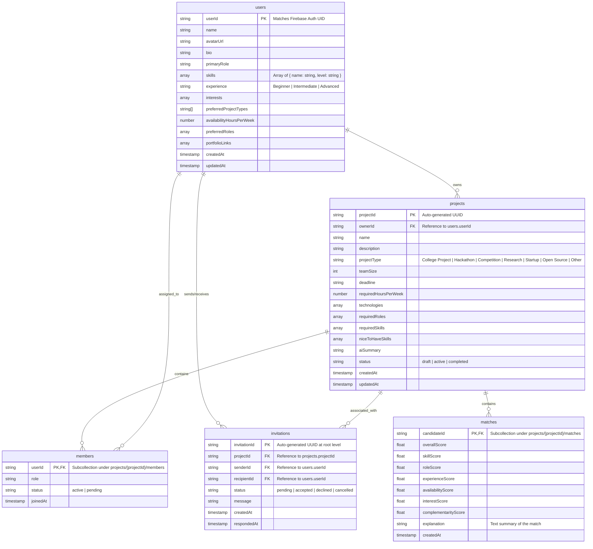

# ProjectMatch --- Implementation Plan (Competition-Ready MVP)

This document serves as the revised implementation blueprint and system architecture design for **ProjectMatch**, an AI-powered team formation platform. It follows the authoritative specifications set forth in [PROJECTMATCH_SINGLE_SOURCE_OF_TRUTH.md](file:///c:/Users/Mohammed%20Aarif/Downloads/PROJECTMATCH_SINGLE_SOURCE_OF_TRUTH.md) and incorporates all recent targeted corrections including explicit formulas, security rules, and data payloads.

---

## 1. Project Overview

ProjectMatch is a specialized AI-assisted team formation engine designed for students and event participants to build optimized, complementary teams. Rather than relying on simple search directories or generic chat platforms, ProjectMatch parses natural language project descriptions, extracts precise role/skill requirements, matches candidates using a transparent scoring system, and provides an interactive Team Builder that detects skill gaps and offers actionable AI recommendations.

### Core Value Loop
```
Project Description 
  → AI Requirement Analysis 
  → Required Roles & Skills 
  → Candidate Matching 
  → Explainable Compatibility Scores 
  → Team Builder (with What-if Simulation Preview)
  → Skill Coverage & Gap Detection 
  → AI Team Improvement Recommendation
```

---

## Implementation Constraints

### 1. Source of Truth Hierarchy

* `PROJECTMATCH_SINGLE_SOURCE_OF_TRUTH.md` is the authoritative source for WHAT the product must do.
* `IMPLEMENTATION_PLAN.md` is the authoritative engineering blueprint for HOW the product should be built.
* If an implementation decision is not explicitly specified, choose the simplest solution consistent with both documents.
* Do not silently change or remove requirements from the SOT.

### 2. Deterministic Scoring Rule

Gemini must NEVER generate, decide, modify, or override numerical compatibility scores.

All candidate compatibility scores and team compatibility scores must be calculated deterministically using the formulas defined in this implementation plan.

Gemini may be used for:

* project requirement extraction
* natural-language match explanations
* team improvement recommendations

### 3. Competition Reliability Rule

The application must remain demonstrable even if:

* Gemini is unavailable
* the backend API is unavailable
* Firebase is unavailable
* network connectivity is unavailable

Demo Mode, local seed data, deterministic matching, local fallback analysis, and precomputed fallback explanations must remain functional.

### 4. Scope Control

Do not add features that are not required by the SOT or this implementation plan.

Do not introduce unnecessary:

* social networking features
* messaging systems
* notification systems
* complex admin dashboards
* enterprise functionality
* unnecessary third-party services

Any feature outside the defined scope must require explicit approval before implementation.

### 5. Competition Priority

When making implementation decisions, prioritize:

1. Core functionality
2. AI usefulness
3. Deterministic and explainable matching
4. Team Builder experience
5. What-if Team Simulation
6. Demo reliability
7. Visual polish
8. Maintainability

The application must be optimized for a clear and impressive 3–5 minute competition demonstration.

### 6. Development Discipline

Implement the application incrementally.

Do not generate the entire application blindly in one step.

After each major implementation phase:

* run validation
* fix errors
* verify functionality
* report what was completed

Do not proceed to a major subsequent phase without confirmation when instructed to wait.

---

## 2. Chosen Technology Stack & Justification

To build a high-performance, competition-ready MVP that is robust and easily demonstrable, the following stack has been selected:

| Layer | Technology | Justification |
| :--- | :--- | :--- |
| **Frontend** | **React (TypeScript)** | Robust component model, type-safety, rapid UI composition. |
| **Styling** | **Tailwind CSS** | Fast custom styling, easy utility-based premium layout design, clean responsive grids. |
| **Build Tool** | **Vite** | Near-instant hot module reloading (HMR) and fast build performance, critical for fast iteration. |
| **Database** | **Cloud Firestore** | Real-time listeners, flexible document structure, offline capabilities, zero backend boilerplate for CRUD. |
| **Auth** | **Firebase Authentication** | Pre-built secure authentication (email/password and Google login) with minimal setup. |
| **Secure AI Integration**| **Node.js + Express Server** | A lightweight backend service to securely invoke the Gemini API. This keeps the `GEMINI_API_KEY` hidden from the client. |
| **AI LLM Engine** | **Gemini API (via SDK)** | Strong structured JSON output generation, high speed, and native compatibility with Google developer ecosystem. |

---

## 3. Folder Structure

We will use a monorepo-style structure containing a `frontend` Vite app and a `backend` Express server to keep our secure credentials hidden.

```text
/
├── package.json               # Root package.json to orchestrate both environments
├── tsconfig.json              # Shared TypeScript base configuration
├── .gitignore                 # Root git ignore
├── README.md                  # Documentation overview
├── IMPLEMENTATION_PLAN.md     # This file
├── backend/                   # Secure Express Backend
│   ├── package.json
│   ├── tsconfig.json
│   ├── .env.example           # Variables template (GEMINI_API_KEY)
│   └── src/
│       ├── server.ts          # Express App Entry Point
│       ├── config/
│       │   └── prompts.ts     # Versioned system prompts for Gemini AI
│       └── routes/
│           └── ai.ts          # Endpoints: /api/analyze, /api/explain-match, /api/improve-team
└── frontend/                  # React Frontend
    ├── package.json
    ├── vite.config.ts         # Vite configuration with backend proxy enabled
    ├── tailwind.config.js
    ├── index.html
    └── src/
        ├── main.tsx
        ├── index.css          # Design system, variables, custom scrollbars, animations
        ├── App.tsx            # Navigation and page routing
        ├── config/
        │   ├── matchingConfig.ts # Centralized match weights and criteria
        │   └── seedCandidates.ts # 10 Fictional Candidate Profiles & Demo Project
        ├── context/
        │   ├── AuthContext.tsx    # Firebase Auth provider / Local Demo Auth fallback
        │   └── AppStateContext.tsx # Global state provider for mock storage fallback
        ├── services/
        │   ├── firebase.ts    # Firebase client initialization
        │   ├── db.ts          # Firestore database helper functions
        │   └── api.ts         # Secure backend API endpoints client
        ├── hooks/
        │   ├── useMatchingEngine.ts # Deterministic matching calculator
        │   └── useTeamMetrics.ts    # Computes coverage, gaps, and team compatibility
        ├── components/
        │   ├── common/        # Button, Input, Modal, GlassCard, Badge, ProgressRing
        │   ├── candidate/     # CandidateCard, CandidateProfileModal, MatchBreakdown
        │   ├── team/          # TeamBuilderPanel, CoverageBar, GapIndicator
        │   └── layout/        # Navbar, Sidebar, PageContainer
        └── pages/
            ├── Landing.tsx    # High-impact landing page
            ├── Login.tsx      # Auth screen
            ├── Onboarding.tsx # Profile wizard
            ├── Dashboard.tsx  # Projects overview & invitations
            ├── CreateProject.tsx # Project creation form
            ├── ProjectAnalysis.tsx # AI requirements review & editing
            ├── TeamBuilderPage.tsx # Interactive candidate matcher (Primary UX)
            ├── ProjectDetail.tsx # Full status overview of a project
            └── Invitations.tsx # Received & Sent requests
```

---

## 4. Firestore Database Architecture

To ensure consistency and avoid contradictory relationships, the Firestore schema uses a flat root collection approach for primary entities and dedicated subcollections for team associations.



---

## 5. Architectural Rule: Deterministic Score Engine

The Gemini model is strictly prohibited from deciding or generating final numerical compatibility scores. Numerical scoring is computed deterministically in application code (accessible client-side via the `useMatchingEngine` hook or server-side if pre-caching) using the configured weights.

### Weight Distribution
The weights must be configured in a single, central config file (`src/config/matchingConfig.ts`):
*   **Skill Match ($w_{skill}$)**: **35%**
*   **Role Match ($w_{role}$)**: **20%**
*   **Experience Match ($w_{exp}$)**: **15%**
*   **Availability Match ($w_{avail}$)**: **15%**
*   **Interest/Project-Type Match ($w_{interest}$)**: **10%**
*   **Complementarity/Team-Gap Contribution ($w_{comp}$)**: **5%**

### Score Calculation Formulas
$$S_{total} = (0.35 \cdot S_{skill}) + (0.20 \cdot S_{role}) + (0.15 \cdot S_{exp}) + (0.15 \cdot S_{avail}) + (0.10 \cdot S_{interest}) + (0.05 \cdot S_{comp})$$

#### 1. Skill Score ($S_{skill}$)
*   User skills are represented as: `skills: { name: string, level: 'Beginner' | 'Intermediate' | 'Proficient' | 'Advanced' }[]`.
*   We assign numeric coefficients to these proficiency levels:
    *   `Advanced` = $1.0$
    *   `Proficient` = $0.9$
    *   `Intermediate` = $0.7$
    *   `Beginner` = $0.4$
*   Let $N_{req}$ be the number of project required skills.
*   For each required skill, if the candidate possesses it, add the corresponding level coefficient. If absent, add $0$.
*   Let the sum of these coefficients be $S_{coef\_sum}$.
*   The raw skill match is calculated as: $S_{raw\_skill} = S_{coef\_sum} / N_{req}$.
*   For every nice-to-have skill matched, add a $+0.05$ bonus to $S_{raw\_skill}$.
*   $S_{skill} = \min(1.0, S_{raw\_skill})$.

#### 2. Role Score ($S_{role}$)
*   $1.0$ if candidate's `primaryRole` matches one of the project's `requiredRoles`.
*   $0.8$ if candidate's `preferredRoles` contains a matching role.
*   $0.2$ if primary role is adjacent; $0.0$ if no overlap.

#### 3. Experience Score ($S_{exp}$)
*   Compare candidate experience level against project complexity (Beginner, Intermediate, Advanced).
*   Exact match or higher = $1.0$.
*   One level below = $0.7$. Two levels below = $0.3$.

#### 4. Availability Score ($S_{avail}$)
*   Uses numeric fields: `availabilityHoursPerWeek` (candidate) and `requiredHoursPerWeek` (project).
*   Let $H_{req}$ be the project's `requiredHoursPerWeek` and $H_{cand}$ be the candidate's `availabilityHoursPerWeek`.
*   If $H_{cand} \ge H_{req}$ then $S_{avail} = 1.0$.
*   If $H_{cand} < H_{req}$ then $S_{avail} = H_{cand} / H_{req}$.

#### 5. Interest Score ($S_{interest}$)
*   Matches: project type (`projectType`), technologies (`technologies`), candidate interests (`interests`), and candidate preferred project types (`preferredProjectTypes`).
*   Let $T_{proj}$ be the set of project type and technologies: $T_{proj} = \{ projectType \} \cup technologies$.
*   Let $I_{cand}$ be the set of candidate interests and preferred project types: $I_{cand} = interests \cup preferredProjectTypes$.
*   The score is the Jaccard similarity of these sets: $S_{interest} = |T_{proj} \cap I_{cand}| / |T_{proj} \cup I_{cand}|$.

#### 6. Complementarity Score ($S_{comp}$)
*   Calculates the normalized percentage of remaining project requirements filled by the candidate.
*   Let $R_{missing}$ be the set of required skills and roles that are *not currently covered* by the existing active team members.
*   Let $R_{cand\_added}$ be the subset of $R_{missing}$ that the candidate satisfies (i.e. skills with level $\ge$ Beginner, or role match $\ge$ 0.8).
*   The complementarity score is:
    $$S_{comp} = \frac{|R_{cand\_added}|}{|R_{missing}|}$$
    If there are no missing requirements ($|R_{missing}| = 0$), then $S_{comp} = 1.0$.
*   The result is naturally capped between $0.0$ and $1.0$.

---

## 6. Deterministic Team Compatibility Formula

The overall team compatibility percentage shown in the Team Builder is calculated deterministically. It does not use LLM generation, ensuring immediate execution and testability.

Let a team consist of $M$ active members. The project requires a set of skills $Skills_{req}$ and roles $Roles_{req}$.
We define:
*   **Skill Coverage ($C_{skills}$)**: The fraction of required skills possessed by at least one member of the team at an `Intermediate` level or higher.
    $$C_{skills} = \frac{|\{ s \in Skills_{req} \mid \exists \text{ member with skill } s \text{ at level } \ge \text{Intermediate} \}|}{|Skills_{req}|}$$
*   **Role Coverage ($C_{roles}$)**: The fraction of required roles covered by at least one member of the team.
    $$C_{roles} = \frac{|\{ r \in Roles_{req} \mid \exists \text{ member with primary/preferred role } r \}|}{|Roles_{req}|}$$
*   **Average Candidate Compatibility ($S_{avg\_cand}$)**: The arithmetic mean of the individual candidate scores of all active team members:
    $$S_{avg\_cand} = \frac{1}{M} \sum_{i=1}^{M} S_{total}(member_i)$$
*   **Availability Compatibility ($C_{avail}$)**: Measures the sufficiency of hours contributed by the team.
    $$C_{avail} = \frac{1}{M} \sum_{i=1}^{M} \min\left(1.0, \frac{\text{availabilityHoursPerWeek}(member_i)}{\text{requiredHoursPerWeek}}\right)$$

The overall **Team Compatibility Score ($S_{team}$)** is:
$$S_{team} = (0.40 \cdot C_{skills}) + (0.25 \cdot C_{roles}) + (0.25 \cdot S_{avg\_cand}) + (0.10 \cdot C_{avail})$$

---

## 7. Backend API & Restrictive Payloads

To protect user privacy and minimize payload size, AI endpoints only receive the fields necessary for their operation. All sensitive fields (e.g. passwords, authentication tokens, contact phone numbers) are stripped.

### Endpoint Payloads

#### 1. `/api/analyze`
*   **Method**: `POST`
*   **Request Payload**:
    ```json
    {
      "description": "string (raw natural language)"
    }
    ```
*   **Response Payload**: Adheres to the JSON schema in SOT Section 21.

#### 2. `/api/explain-match`
*   **Method**: `POST`
*   **Request Payload**:
    ```json
    {
      "projectId": "string",
      "requiredSkills": ["string"],
      "requiredRoles": ["string"],
      "candidate": {
        "candidateId": "string",
        "bio": "string",
        "primaryRole": "string",
        "skills": [{ "name": "string", "level": "string" }],
        "experience": "string",
        "availabilityHoursPerWeek": 15,
        "interests": ["string"],
        "preferredProjectTypes": ["string"]
      },
      "deterministicScores": {
        "overallScore": 0.85,
        "skillScore": 0.90,
        "roleScore": 1.0,
        "experienceScore": 0.80,
        "availabilityScore": 1.0,
        "interestScore": 0.70,
        "complementarityScore": 0.60
      }
    }
    ```
*   **Response Payload**: `{ "explanation": "string (1-2 sentences)" }`

#### 3. `/api/improve-team`
*   **Method**: `POST`
*   **Request Payload**:
    ```json
    {
      "project": {
        "projectId": "string",
        "requiredSkills": ["string"],
        "requiredRoles": ["string"]
      },
      "currentTeam": [
        {
          "candidateId": "string",
          "role": "string",
          "skills": [{ "name": "string", "level": "string" }]
        }
      ],
      "candidatesPool": [
        {
          "candidateId": "string",
          "primaryRole": "string",
          "skills": [{ "name": "string", "level": "string" }],
          "experience": "string",
          "availabilityHoursPerWeek": 12,
          "interests": ["string"],
          "preferredProjectTypes": ["string"]
        }
      ]
    }
    ```
*   **Response Payload**:
    ```json
    {
      "recommendedCandidateId": "string",
      "suggestedRole": "string",
      "reasoning": "string"
    }
    ```

---

## 8. Firestore Security Rules

The database security rules enforce authorization limits to prevent unauthorized data modifications.

```javascript
rules_version = '2';
service cloud.firestore {
  match /databases/{database}/documents {
    
    // Core helper checks
    function isAuthenticated() {
      return request.auth != null;
    }
    
    function isOwner(userId) {
      return request.auth.uid == userId;
    }
    
    function getProjectOwner(projectId) {
      return get(/databases/$(database)/documents/projects/$(projectId)).data.ownerId;
    }
    
    function isProjectOwner(projectId) {
      return request.auth.uid == getProjectOwner(projectId);
    }

    // 1. Users Collection
    match /users/{userId} {
      // Authenticated users can view other profiles
      allow read: if isAuthenticated();
      // Users can only write/edit their own profile details
      allow create, update: if isAuthenticated() && isOwner(userId);
      allow delete: if false; // Profiles cannot be deleted in MVP
    }

    // 2. Projects Collection
    match /projects/{projectId} {
      allow read: if isAuthenticated();
      // Only authenticated users can register projects, assigning themselves as ownerId
      allow create: if isAuthenticated() && request.resource.data.ownerId == request.auth.uid;
      // Only project owners can edit or delete projects
      allow update, delete: if isAuthenticated() && isProjectOwner(projectId);

      // Members Subcollection
      match /members/{memberId} {
        allow read: if isAuthenticated();
        // Project owner can write members; users can remove themselves (leave project)
        allow write: if isAuthenticated() && (isProjectOwner(projectId) || isOwner(memberId));
      }

      // Matches Subcollection (Calculated and cached matches)
      match /matches/{candidateId} {
        allow read: if isAuthenticated();
        // Project owner can cache/update calculated matches
        allow write: if isAuthenticated() && isProjectOwner(projectId);
      }
    }

    // 3. Invitations Collection
    match /invitations/{invitationId} {
      // Senders and recipients can view invitations
      allow read: if isAuthenticated() && (
        resource.data.senderId == request.auth.uid || 
        resource.data.recipientId == request.auth.uid
      );
      // Senders can create invitations
      allow create: if isAuthenticated() && request.resource.data.senderId == request.auth.uid;
      // Recipients can accept/decline; senders can cancel
      allow update: if isAuthenticated() && (
        isOwner(resource.data.recipientId) || 
        (isOwner(resource.data.senderId) && request.resource.data.status == 'cancelled')
      );
      allow delete: if false;
    }
  }
}
```

---

## 9. UX, Visual Explanations, & What-if Previews

### A. AI Project Analysis UI
*   **Layout**: Displays the AI-generated project summary at the top.
*   **Requirements Grid**: Cards show *Project Type*, *Complexity*, and *Recommended Team Size*.
*   **Skills & Roles Tables**: Lists required roles, required skills, and nice-to-have skills.
*   **Interactive Control**: Every single tag is editable with a click-to-delete `[x]` or input box, giving users full final control.

### B. Visual Scorecards
*   **Radial Percentage Badge**: Matches are color-coded (90-100: Excellent, 80-89: Strong, 70-79: Good, 60-69: Potential, Below 60: Low).
*   **Six-Factor Bar Chart**: Displays visual progress indicators for Skills (35%), Role (20%), Experience (15%), Availability (15%), Interests (10%), and Complementarity (5%).
*   **Explanation Panel**: Expandable "Why this Match?" drawer fetching the `explanation` string from the matches subcollection.

### C. What-if Simulation Interaction (Click-to-Preview)
Rather than relying on hover events, the UI provides an explicit preview interaction:
1.  **Trigger**: Each candidate card in the matching drawer has a **"Preview Team Impact"** button.
2.  **Display**: Clicking this opens a sticky side-drawer/modal showing:
    *   *Current Compatibility* vs. *Predicted Compatibility* (e.g. `82% → 89%`) with a colored delta (`+7%`).
    *   *Skill Coverage changes*: Visual bars showing before/after states (e.g. UI/UX: `0% → 100%`).
    *   *Gap Resolution*: Alerts showing which gaps are solved (e.g. `[RESOLVED] Missing UI/UX Designer`) or newly created conflicts.
3.  **Actions**: "Add to Team" (confirms candidate placement) and "Cancel Preview" buttons. Works on mobile, tablet, and desktop screens.

---

## 10. Resilient Offline Core & Fallback Parser

### A. One-Click Demo Mode
*   **Bypass**: The login screen displays a prominent "Demo Mode Login" action.
*   **State**: Bypasses Firebase Auth. Automatically initiates a local memory state and reads from browser `localStorage`. No network connection is required.

### B. Fallback Local Dictionary Parser
If the Gemini API or Express server is unavailable, the frontend uses a case-insensitive, local dictionary to extract requirements:
```typescript
const LOCAL_EXTRACTION_DICTIONARY = {
  skills: [
    "react", "typescript", "firebase", "python", "node", "javascript", "html", 
    "css", "postgresql", "go", "docker", "flutter", "swift", "c++", "pytorch", 
    "tensorflow", "figma", "tailwind", "next.js", "vite", "sql", "aws"
  ],
  roles: [
    "frontend developer", "backend developer", "full stack developer", 
    "ai/ml developer", "ui/ux designer", "product manager", "domain expert",
    "data engineer", "mobile developer", "cybersecurity student", "researcher"
  ]
};
```
*   **Regex Engine**: Matches strings case-insensitively. Automatically extracts matched values into *Required Skills* and *Required Roles*, setting complexity to `Intermediate`.
*   **Local Matches**: Each of the 10 seed candidate records has precomputed explanation strings corresponding to the "SmartCampus AI Assistant" demo project description, ensuring a high-fidelity mock presentation.

### C. Debug Toolbar
*   A key combination (`Ctrl+Shift+D`) or triple-tapping the logo opens a developer toolbar. It allows quick toggling of simulation states (e.g. Force Offline Mode, Mock Gemini Offline, Load 4/5 Team).

---

## 11. Competition Demo Flow (3-5 Minute Script)

| Time | Screen / State | Actions & Presenter Script |
| :--- | :--- | :--- |
| **0:00 - 0:30** | Landing Page | Presenter introduces the platform. Clicks "Demo Mode Login" to enter the system instantly without registering. |
| **0:30 - 1:00** | Create Project | Presenter clicks "Autofill Demo Project" (populates SmartCampus description). Clicks "Analyze Project with AI". |
| **1:00 - 1:30** | Project Analysis | Shows the AI-extracted project summary, metadata, required/nice-to-have skills, and recommended team size. Edits one skill to demonstrate control. Clicks "Find Candidate Pool". |
| **1:30 - 2:15** | Candidate Discovery | Renders candidate pool. Expands a card to show the visual match breakdown (6 metrics) and the natural-language "Why this Match?" explanation. |
| **2:15 - 3:00** | Team Builder Workspace | Clicks "Preview Team Impact" on a candidate. Highlights predicted compatibility score delta, skill coverage gains, and resolved gaps. Confirms addition. |
| **3:00 - 3:45** | Team Improvement | Assembles a team with a clear missing skill. Clicks "Improve My Team". AI recommends the perfect final candidate. Candidate is added to resolve the gap. |

---

## 12. Testing & Validation Checklist

*   [ ] **Type Safety & Build**: Ensure `tsc --noEmit` and `npm run lint` pass with no compiler warnings.
*   [ ] **Deterministic Scores Test**: Verify numerical matching outputs are deterministic and match the configured weight allocation.
*   [ ] **Offline Resiliency Test**: Use the debug toolbar to switch to offline mode and verify that local analysis, candidate matching, and pre-seeded explanations work.
*   [ ] **Team Simulation Test**: Verify that clicking "Preview Team Impact" displays correct delta overlays on compatibility, coverage, and gaps.
