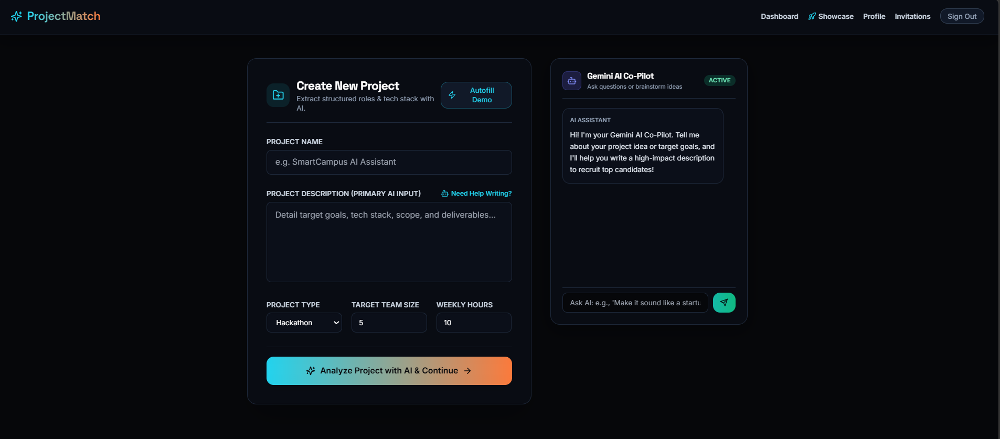
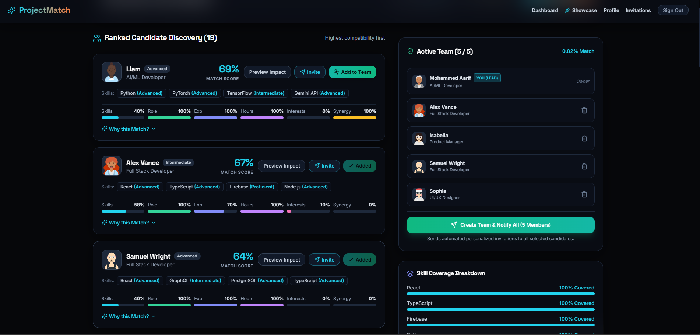
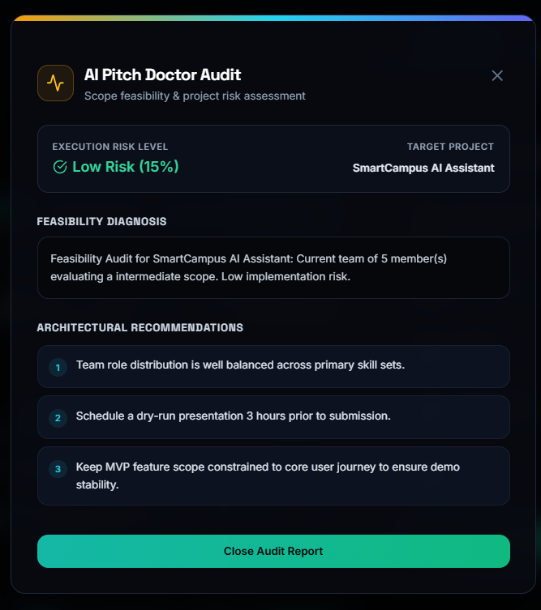
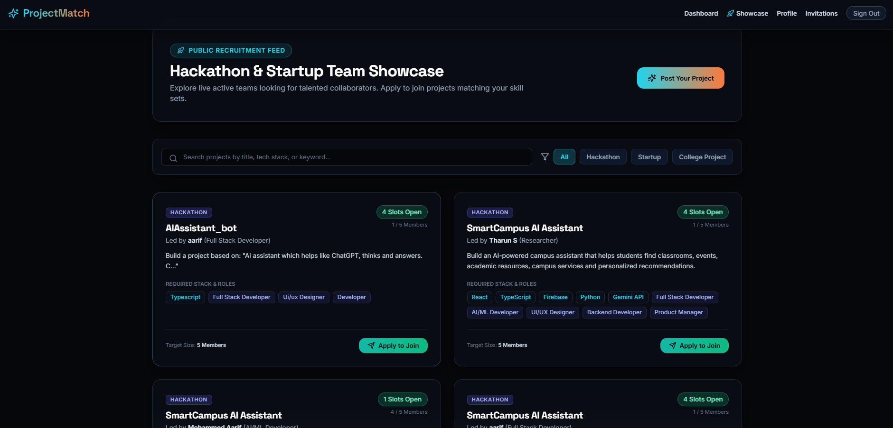
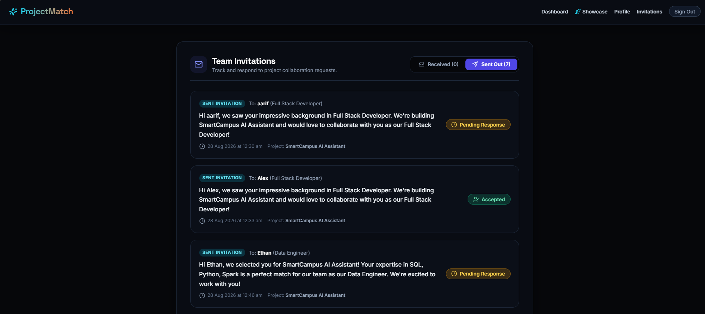

# ProjectMatch — AI-Powered Hackathon & Startup Team Formation Platform

ProjectMatch is a competition-ready, AI-driven team-formation engine that analyzes natural-language project descriptions to extract requirements, matches candidates using a deterministic weighted scoring algorithm, and provides an interactive Team Builder featuring real-time complementarity scores, What-if preview simulation, AI Pitch Doctor feasibility audits, and a public recruitment showcase feed.

---

## 1. Project Name
**ProjectMatch** — AI-Powered Hackathon & Startup Team Formation Platform

---

## 2. Problem Statement
Forming effective teams for hackathons and early-stage startups is often chaotic and inefficient. Project creators struggle to find teammates with complementary skill sets, balanced experience levels, and aligned availability. Conversely, skilled candidates struggle to discover projects that match their expertise and interests.

**ProjectMatch** solves this by using AI-driven natural language processing and deterministic multi-factor matching algorithms to instantly analyze project scopes, match optimal candidates, audit project execution risks, and streamline team invitations.

---

## 3. Features

### Core Features
- 🎯 **Deterministically Scored Matching Engine**: Multi-factor candidate compatibility scoring based on Skills, Roles, Experience Level, Availability Hours, Interests, and Team Synergy.
- 👥 **Dynamic Active Team Builder**: Interactive workspace to assemble teams, preview candidate additions with real-time score updates, and manage team composition.
- 🚀 **Public Recruitment Feed (Showcase)**: Live feed for open hackathon/startup teams to recruit missing roles, featuring search by tech stack and one-click applications.
- 📨 **Direct Invitations Inbox**: Categorized **Received** and **Sent Out** tabs with exact timestamped audit logs and interactive accept/decline responses.
- 🔐 **Authentication & Onboarding**: Seamless user onboarding with skill profile creation, avatar uploads, and persistent session state.

### AI & Smart Features
- 🤖 **Gemini AI Project Co-Pilot**: Interactive chat assistant that helps creators refine project descriptions and auto-fills optimal input during project creation.
- 🩺 **AI Pitch Doctor (Feasibility Audit)**: Analyzes project scope and current team composition to calculate execution risk (`Low`, `Medium`, `High`) and return strategic architectural recommendations.
- 💡 **AI Match Explanations**: Generates contextual natural-language rationales explaining why specific candidates fit a project.

---

## 4. Technology Stack

- **Frontend**: React (TypeScript), Vite, Tailwind CSS, Lucide Icons, Firebase Client SDK
- **Backend**: Node.js, Express, TypeScript, Google Gen AI SDK (Gemini 1.5 Flash API)
- **Database**: Cloud Firestore (with LocalStorage fallback)
- **Authentication**: Firebase Authentication (Email/Password & Google Auth) with Demo Mode support

---

## 5. Screenshots

> **Note for Submission**: Upload your application screenshots to a folder named `docs/screenshots/` (or host them online) and update the image paths below.

### Create Project & AI Co-Pilot


### Candidate Matching & Scoring


### Team Builder & AI Pitch Doctor


### Public Showcase Feed


### Invitations Inbox


---

## 6. Live Demo
- **Frontend Vercel URL**: `https://frontend-six-sand-64.vercel.app/`

---

## 7. Backend
- **Backend Vercel API URL**: `https://backend-navy-eight-64.vercel.app/`

---

## 8. Setup Instructions

### Prerequisites
- **Node.js**: Version 20 or higher recommended.
- **NPM**: Installed alongside Node.js.

### Installation

1. **Clone the repository**:
   ```bash
   git clone https://github.com/your-username/ProjectMatch.git
   cd ProjectMatch
   ```

2. **Install root & package dependencies**:
   ```bash
   npm run install
   ```

3. **Configure Environment Variables**:
   - Create `backend/.env` based on `backend/.env.example`.
   - Create `frontend/.env` based on `frontend/.env.example`.

4. **Launch Local Development Server**:
   ```bash
   npm run dev
   ```
   This will start both the Express backend on `http://localhost:5000` and the Vite React frontend on `http://localhost:5173`.

---

## 9. Environment Variables

Below are the required environment variable keys for configuring the frontend and backend locally and in production deployment settings:

### Backend (`backend/.env`)
```env
PORT=5000
GEMINI_API_KEY=your_google_gemini_api_key
```

### Frontend (`frontend/.env`)
```env
VITE_BACKEND_URL=http://localhost:5000
VITE_FIREBASE_API_KEY=your_firebase_api_key
VITE_FIREBASE_AUTH_DOMAIN=your_firebase_auth_domain
VITE_FIREBASE_PROJECT_ID=your_firebase_project_id
VITE_FIREBASE_STORAGE_BUCKET=your_firebase_storage_bucket
VITE_FIREBASE_MESSAGING_SENDER_ID=your_firebase_messaging_sender_id
VITE_FIREBASE_APP_ID=your_firebase_app_id
```

> **Important**: Never commit actual API keys, passwords, or secret credentials to GitHub. Always use environment variables on hosting platforms like Vercel and Render.
